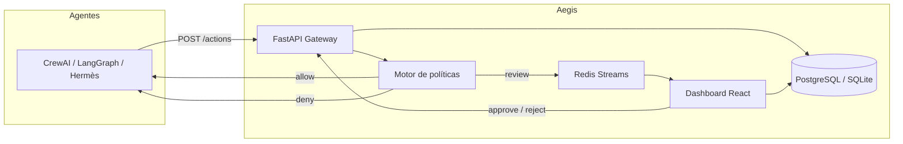

# Aegis

Capa de gobernanza y permisos para agentes de IA.

Aegis se sienta delante de las acciones de otros agentes (CrewAI, LangGraph, Hermès) y decide, antes de ejecutar, si permitir la acción, exigir aprobación humana o denegarla — dejando un registro auditable.

## Stack

- **Backend**: FastAPI + Python + SQLAlchemy async
- **Cola de aprobación**: Redis Streams
- **Persistencia**: PostgreSQL (SQLite en desarrollo simple)
- **Dashboard**: React + TypeScript + Vite
- **Empaquetado**: Docker + docker-compose
- **SDK**: Decorador/wrapper Python para CrewAI

## Arquitectura



## Fases del MVP

1. **Fase 0 — Scaffolding e identidad**: estructura del repo, docker-compose, modelos de datos, registro de agentes con credenciales y scopes.
2. **Fase 1 — Gateway + auditoría**: endpoint `POST /actions`, audit log inmutable.
3. **Fase 2 — Motor de políticas**: reglas de riesgo `allow/review/deny` con matching de patrones y scopes.
4. **Fase 3 — Cola de aprobación + dashboard**: Redis Streams, UI de aprobación/rechazo con polling.
5. **Fase 4 — SDK CrewAI**: decorador `aegis_guard` probado sobre CrewAI tools.
6. **Fase 5 — Risk score + docs**: scoring OWASP-like 0-100, vista de auditoría filtrable y documentación.

## Ejecutar localmente

### Con Docker

```bash
docker compose up --build
```

### Backend en desarrollo ligero

```bash
cd backend
python -m venv .venv
source .venv/bin/activate
pip install -r requirements.txt
uvicorn app.main:app --reload
```

### Dashboard

```bash
cd dashboard
npm install
npm run dev
```

### SDK

```bash
cd sdk/python
pip install -e .
```

## Variables de entorno

Ver `.env.example`.

| Variable | Descripción | Default |
|----------|-------------|---------|
| `DATABASE_URL` | URL de la base de datos | `sqlite+aiosqlite:///./aegis.db` |
| `REDIS_URL` | URL de Redis | `redis://localhost:6379/0` |
| `SECRET_KEY` | Clave para desarrollo | `dev-secret-key` |

## Endpoints principales

### Agentes

- `POST /agents` — registrar agente (devuelve API key una sola vez)
- `GET /agents/{id}` — obtener agente
- `PATCH /agents/{id}` — actualizar agente

### Acciones

- `POST /actions` — enviar acción desde un agente
- `GET /actions` — listar acciones con filtros (`status`, `action_type`, `agent_id`)
- `GET /actions/{id}` — obtener acción
- `POST /actions/{id}/approve` — aprobar acción pendiente
- `POST /actions/{id}/reject` — rechazar acción pendiente

### Políticas

- `POST /policies` — crear política
- `GET /policies` — listar políticas activas
- `GET /policies/{id}` — obtener política
- `PATCH /policies/{id}` — actualizar política

### Auditoría

- `GET /audit` — listar logs de auditoría con filtros (`action_id`, `event_type`)

## Motor de políticas

Cada política define:

- `action_type_pattern`: patrón exacto o wildcard (`read_*`, `admin_*`, `*`)
- `risk_level`: `low`, `medium`, `high`, `critical`
- `decision`: `allow`, `review`, `deny`
- `scopes_required`: lista de scopes que el agente debe tener

Si una política dice `allow` pero el agente no tiene los scopes, la decisión final es `deny`.

Si no hay política que coincida:

- Acciones irreversibles (`send_email`, `delete`, `pay`, `deploy`, etc.) van a `review`.
- El resto va a `allow`.

## Risk score

Cada acción recibe un score 0-100 basado en:

- Nivel de riesgo de la política: `low=10`, `medium=30`, `high=60`, `critical=90`
- Acción irreversible: `+15`
- Sin política explícita: `+25`
- Agente sin scopes requeridos: `+20`
- Decisión `deny`: `+10`

Mayor score implica mayor riesgo y probabilidad de requerir revisión humana.

## SDK CrewAI

| Variable | Descripción | Default |
|----------|-------------|---------|
| `DATABASE_URL` | URL de la base de datos | `sqlite+aiosqlite:///./aegis.db` |
| `REDIS_URL` | URL de Redis | `redis://localhost:6379/0` |
| `SECRET_KEY` | Secret para firmas internas | `dev-secret-key` |

## API endpoints principales

- `POST /agents` — registrar agente
- `POST /actions` — enviar acción a evaluar
- `GET /actions` — listar acciones con filtros
- `POST /actions/{id}/approve` — aprobar acción pending
- `POST /actions/{id}/reject` — rechazar acción pending
- `POST /policies` — crear política
- `GET /policies` — listar políticas
- `GET /audit` — listar logs de auditoría con filtros
- `GET /health` — health check de DB + Redis

## Uso del SDK

```python
from aegis_sdk import aegis_guard

@aegis_guard(
    agent_id="uuid-del-agente",
    action_type="write_file",
    auto_approve=True,  # únicamente para demos
)
def write_file_tool(path: str, content: str) -> str:
    with open(path, "w") as f:
        f.write(content)
    return f"Wrote {len(content)} chars"

write_file_tool("/tmp/output.txt", "hello")
```

Comportamiento:

- `approved` → ejecuta la tool.
- `denied` → devuelve mensaje de denegación sin ejecutar.
- `pending` → espera aprobación con polling.

## Tests

```bash
cd backend
pytest -q

cd ../sdk/python
pytest tests/ -q
```
